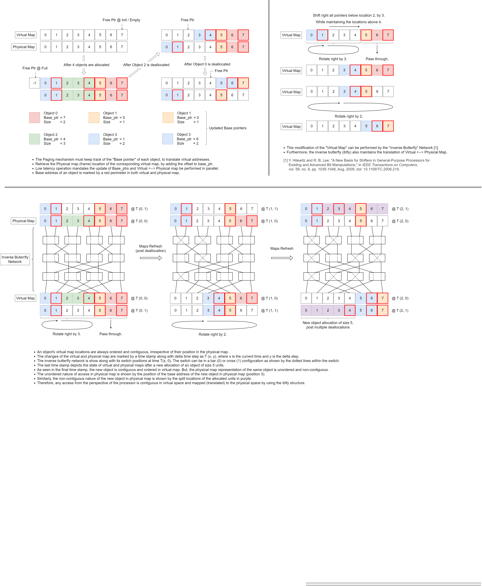

# QuickPage
An experimental, fast and parallel paging mechanism for small scale Last Level Cache (LLC) memories, with NUMA.

## Aim
Contemporary LLC (at the time of QuickPage's inception) do not support Dynamic Memory Allocation.
This leads to inefficient memory performance in workload agnostic scenarios, such as in SpGEMM acceleration,
where the processed data exhibits very good spatial locality and poor temporal locality. The workload seen 
by the Processing unit (PU), in turn the memory subsystem, is very dependent on the sparsity of the row.
For now, a more detailed reasoning towards the necessity of Dyanmic Memory Allocation in LLC can be found by 
looking at my previous projects "VDMMU" and "SpGEMM_Accelerator" under my GitHub page.

Accelerators profit from low latency and parallel operations. Hence, QuickPage is an attempt to provide a 
memory framework that supports:\
&emsp; (1) Low latency allocation with O(1) time complexity (3 cycles for valid reply, pipelined).\
&emsp; (2) Low latency deallocation with O(1) time complexity (5 cycles for valid reply, pipelined).\
&emsp; (3) Low latency virtual to physical address translation. This metric is a bit tricky to quantify,  
&emsp;&emsp; at the moment the translator is capable of supporting 1~2 cycle latency for translating addresses  
&emsp;&emsp; within a block (a set of frames), plus the added single cycle latency to switch between blocks.\
&emsp; (4) Support for multiple concurrent translation ports that are scalable, to support multiple PUs.

## Concept
The below diagram briefly explains the concept behind QuickPage. A more thorough documentation will be 
prepared, but due to time constraints on my end, I appologize and encourage readers to go through the code 
and decompose the architecutre.\

## System Overview

The manager unit encompases the (De)Allocator, Address translator Channel(s) and necessary modules to 
manage the page table. QuickPage provides multiple user controllable parameters, whose functionality are 
explained below along with I/O in the following tables.\

### Parameter Table

| Parameter         | Functionality                                                                                           |
| :---------------- | :------------------------------------------------------------------------------------------------------ |
| REG_INPUTS        | Register all inputs.                                                                                    |
| REG_MEMORY        | Register outputs (translated addresses) to memory module.                                               |
| CHANS             | Number of independent address translator modules / channels. All channels and sub-channels  indicate only the address path, the memory data path is not part of the QuickPage framework  and depends on the implemented memory module and interconnect as shown in the system overview diagram.  |
| LSUS              | Number of independent Load / Store unit sub-cahnnels supported per translator channel.                  |
| LINE_S            | Size of an allocable page / line in bytes.                                                              |
| MEM_D             | Total heap memory depth, i.e., the total number of allocable lines / frames in the heap.                |
| BLOCK_D           | Total number of lines per block, i.e., the span of lines over which an object may be  dynamically allocated. This parameter controls the size of the inverse butterfly structure.             |
| ROW_ADDR_LATENCY  | Adjust the translation latency of all channels and sub-channels (valid values are 1 and 2).             |

The following are non-mutable parameters which are automatically derived from the above parameter values.\

| Parameter         | Functionality                                                                                           |
| :---------------- | :------------------------------------------------------------------------------------------------------ |
| BLOCK_W           | Bit length to represent BLOCK_D.                                                                        |
| BLOCKS            | Total number of blocks present in MEM_D, where each block consists of BLOCK_D lines.                    |
| BLOCK_L           | Bit length to represent BLOCKS.                                                                         |
| REQ_S             | Maximum allocable request size of an object in bytes.                                                   |
| REQ_W             | Bit length to represent REQ_S (inclusive).                                                              |
| REP_W             | Bit length to reprsent the reply from QuickPage after a successful allocation. The reply from \
                      QuickPage is formated as \[Number of allocated lines, Block number, Base address, offset (init to 0)\].\
                      This is also the Object ID used to identify the object during deallocation. Hence must be stored by PU. |
| VADDR_W           | Bit length to represent virtual address to translator.                                                  |
| PADDR_W           | Bit length to represent physical address to memory module (post translation).                           |

### I/O Table

| Pin               | Description                                                                                             |
| :---------------- | :------------------------------------------------------------------------------------------------------ |
| i_clk             | Clock input.                                                                                            |
| i_reset           | Synchronous reset input (active when high).                                                             |
| i_req_id          | 1 Bit request ID. Must be toggled between valid requests. This id is used to mask duplicate requests.   |
| i_req_func        | 2 Bit request function select. Valid values are, 0 = Idle, 1 = Allocate, 2 = Deallocate, 3 = Reserved.  |
| i_req_alloc_size  | Allocation request size in bytes. Valid values range from 0 to REQ_S.                                   |
| i_req_dealloc_data| Oject ID for deallocation.                                                                              |
| i_virt_addr       | Packed virtual addresses of all channels and sub-channels from PUs.                                     |
| o_busy            | Busy signal to upstream processes. High when allocation/deallocation in progress. Can be ignored for \
                      pipelined (sequential) requests of the same type (alloc/dealloc) to achieve better throughput.\
                      But, if the consecutive requests are of different types (alloc followed by dealloc or vice-versa), \
                      the o_busy signal must be respected.                                                                    |
| o_rep_alloc_vld   | Valid signal to indicate successful allocation. High when a valid reply is present on the reply line.   |
| o_rep_dealloc_vld | Valid signal to indicate successful deallocation. High when an deallocation request is complete.        |
| o_rep_data        | Object ID of an allocation request returned to PU upon successful allocation. \
                      Data is ready and valid for read when o_rep_alloc_vld is high.                                          |
| o_mem_addr        | Packed physical addresses of all channels and sub-channels to memory module.                            |

### Performance Metrics

| Metric                           | Description / Value                                                                      |
| :------------------------------- | :--------------------------------------------------------------------------------------- |
| Allocation Latency               | Time required to perform an allocation and reply with a valid Object ID. 3 cycles.       |
| Deallocation Latency             | Time required to perform a deallocation given a valid Ojbect ID. 5 cycles.               |
| Translator Block switch Latency  | Time required by a channel to load a block for translation (the block select is \
                                     controlled by sub-channel 0 in each channel, rest of the sub-channels are forced to \
                                     translate within the same block). 1 cycle.                                               |
| Translator Object switch Latency | The time required to obtain the base address of an object within a block. 1 cycle.       |
| Translator Row switch Latency    | The time required to obtain the physical frame address. 1~2 cycles.                      |
